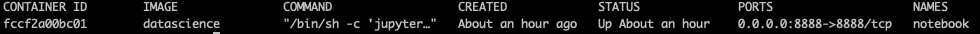
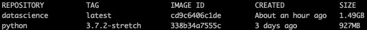

# Data Science Portfolio

A small portfolio to show and practice data science. This project is also aimed to help data scientist to get introduced to Docker on the specific field of data science.

## Getting Started

These instructions will get you a copy of the project up and running on your local machine. 

### Prerequisites

Make sure you have installed [Docker](https://www.docker.com/get-started) in your computer. Try to get your docker version on the command line

```sh 
docker --version
```
It's been tested on  ```Docker version 18.09.0``` but upper versions may work as well.

### Installing

Build the docker image as 

```sh
docker build -t datascience .
```
In this example I tagged the name of the image as *datascience*. It also is possible to execute the bash script ```build.sh```. Next, we need to start the container.

### Running

After successfully installing the image we run the docker container.

```sh
docker run -d -v $(pwd):/home/ -p 8888:8888 --name notebook -i datascience
```

This will map our current directory volume to home in the container, also expose the 8888 port (regular port for Jupyter Notebook). The name of the container is *notebook* and the image that is build from is *datascience* (the one we've just created). As before, you could simply run ```run.sh``` which contains the same commands.

## Accessing the notebooks

If the two previous sections were completed successfully you should have a docker container named *notebook* running. To access the notebooks just open in your browser

```
http://localhost:8888/
```

## Stopping containers and deleting images

To know which containers are up just type in your command line

```sh
docker ps -a
```



In the image above I show my output example. To stop and delete the container:

```sh
docker stop notebook
```
we could also do the same but instead of *notebook* just put the container id. We could start the container with ```docker start notebook```. Once the container is stopped we could delete it as

```sh
docker rm notebook
```
or doing the same with the container id.


To find out about all the images that we have we would run

```sh
docker images
```



In this case we have only two images. To delete *datascience* image we would run

```sh
docker rmi datascience
```

or alternatively ```docker rmi cd9c6406c1de``` or ```docker rmi datascience:latest```. The last option is useful if there are more versions of *datascience* image, then we need to add the tag.


